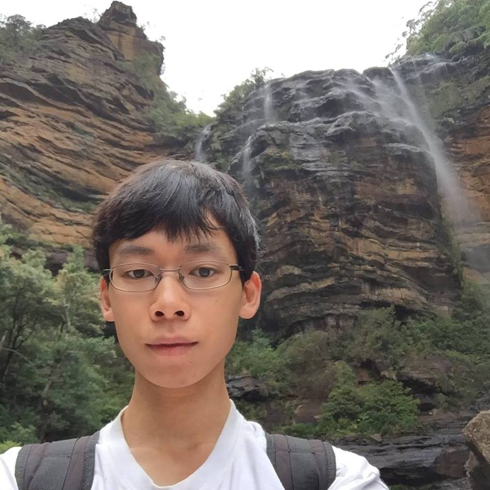
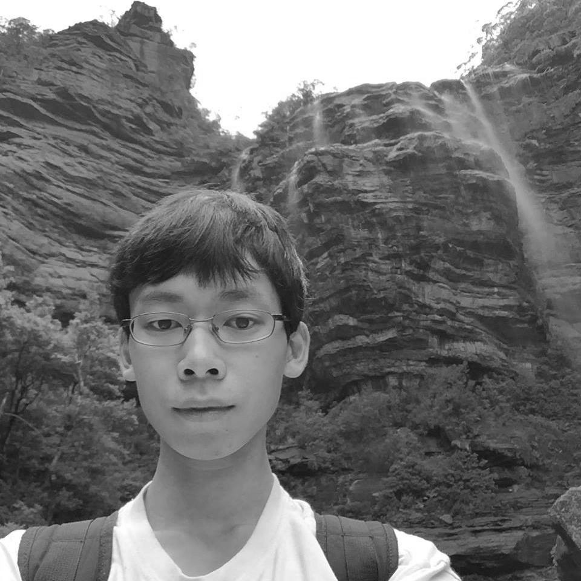
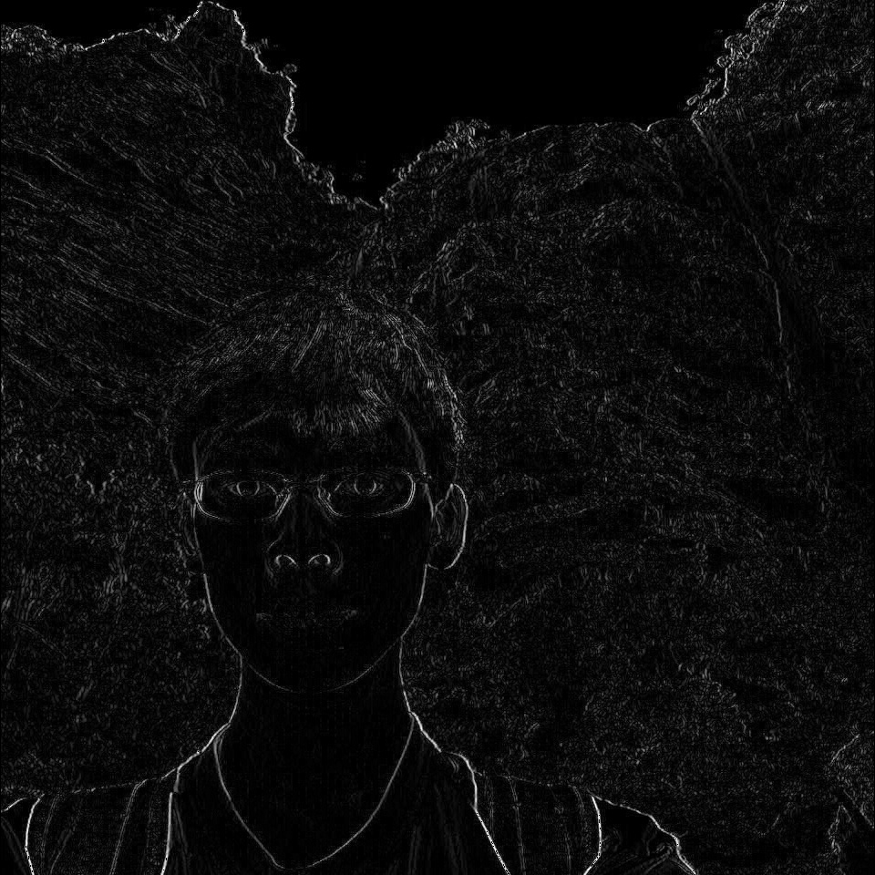

# EC585

Assignment 1

In this assignment, we are asked to convert an image of our face into gray-scale image, then manipulate the image in a fun way.

### Original Image

### Grayscale Image
I converted yto grayscale by averageing the R, G, and B channels.

### Filtered Image
I applied a horizontal edge filter to the image. (calculate the difference between the left and right nirghboring pixels) This highlights the vertical edges. If you look closely, you can even see the edges of the JPEG blocking artifacts, pretty neat.

